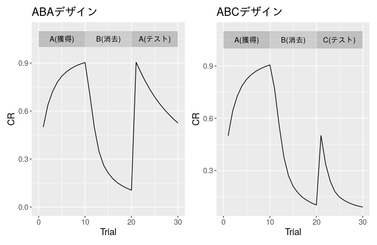
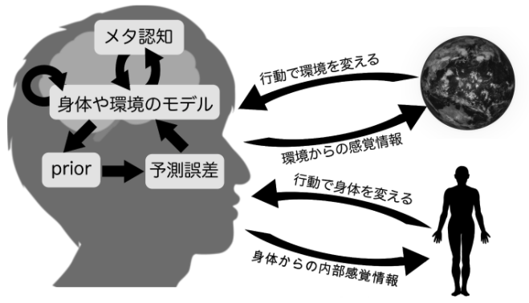
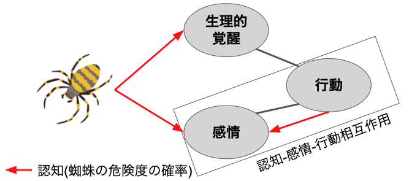
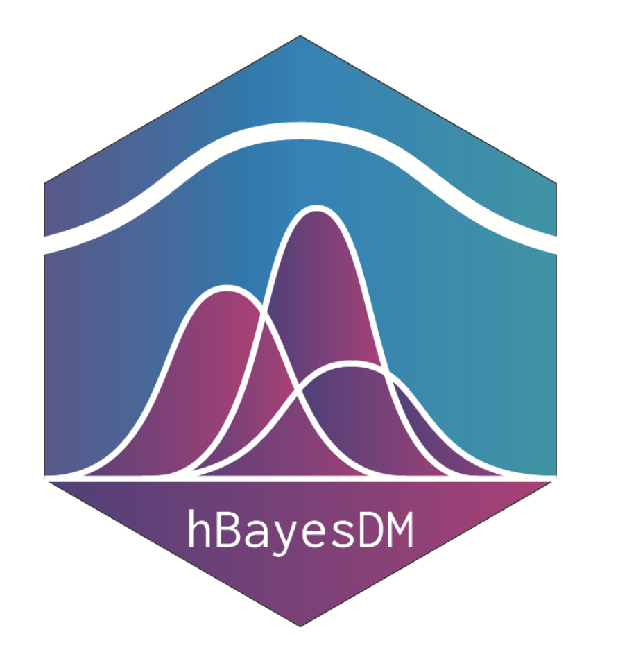

```{r xaringan-themer, include=FALSE, warning=FALSE}
library(xaringanthemer)
extra_css <- list(
  ".red"   = list(color = "red"),
  ".green"   = list(color = "green"),
  ".small" = list("font-size" = "60%"),
  ".med" = list("font-size" = "80%"),
  ".full-width" = list(
    display = "flex",
    width   = "100%",
    flex    = "1 1 auto"
  )
)

style_mono_accent(base_color = "#006400",
  text_font_size = "30px",
  code_font_size = "20px",
  padding = "1em 1em 1em 1em",#margin
  header_h1_font_size = "45px",
  header_h2_font_size = "40px",
  header_h3_font_size = "35px",
  header_color = "#006400",
  header_font_google = google_font("Song Myung"),
  text_font_google   = google_font("Song Myung", "400", "400i"),
  code_font_google   = google_font("Song Myung"),
  link_color = "#A52A2A",
  extra_css = extra_css
)
```

<!-- トップバッター，１８分。スライドは１８枚かな。-->

# 国里愛彦 (くにさと　よしひこ)

- 計算論的アプローチとRをこよなく愛す
- 国里・片平・沖村・山下(2019)『計算論的精神医学: 情報処理過程から読み解く精神障害』勁草書房


---

# うつ病とは？

- 抑うつ気分，興味または喜びの減退が主症状
- 興味または喜びの減退（アンヘドニア）は，特異度が高く，治療反応.med[(Uher et al., 2012)]や社会機能改善を.med[(Vinckier et al., 2017)]予測。
- アンヘドニアについては，認知神経科学的検討がなされてきている。


---

# アンヘドニア研究の枠組み

- Treadway & Zald(2011)は，アンヘドニアを，完了のアンヘドニア(consummatory anhedonia)，動機づけのアンヘドニア(motivational anhedonia)，意思決定のアンヘドニア(decisional anhedonia)の３つに分けた。

---

# 完了のアンヘドニアとうつ

- 神経科学での「好むこと(Liking)」に対応
- 甘味検査(sweet taste test，甘い味に対する快度)では，うつ病患者と健常者で差がない(Dichter et al., 2010)
- .green[うつ病では完了のアンヘドニアはない可能性もあるが，あるとする結果もあり，知見の一貫性が低い。]


---


# 動機づけのアンヘドニアとうつ

- 神経科学での「欲すること(Wanting)」に対応
- .green[EEfRT.small[(Effort-Expenditure for Reward Task)]で，うつ病は，対照群よりも努力が少なくて済む課題を選ぶ.med[(Treadway et al, 2012; Yang et al., 2014)]]

- メタ分析では，動機づけのアンヘドニアは小-中程度の効果量(d=0.31).med[(Halahakoon et al., 2020)]

---


# 意思決定のアンヘドニアとうつ

- 神経科学での「学習(Learning)」に対応
- .green[確率的報酬課題で，抑うつ高者やうつ病患者は，対照群よりも報酬のフィードバックの偏りに対するバイアスが弱い.med[Pizzagalli et al., 2005; Pizzagalli et al., 2008)]]

- メタ分析では，反応バイアスは中程度(d=0.64),強化学習は小-中程度(d=0.35)の効果量.med[(Halahakoon et al., 2020)]

---

# アンヘドニアの研究枠組み

- Treadway & Zald(2011)の３つのアンヘドニアは，NIMHのResearch Domain Criteria(RDoC)でのPositive Valence Systemsに対応.med[(完了のアンヘドニア=Reward Responsiveness，動機づけのアンヘドニア=Reward Valuation，意思決定のアンヘドニア=Reward Learning)]
- 質問紙研究でも３因子が抽出.med[(Ang et al., 2017)]
- ３つのアンヘドニアは，研究枠組みとして良さそうだが，認知神経科学研究の場合，生理・神経・行動・主観などで説明のギャップが生じる。
- .green[説明のギャップをうまく埋めるアプローチはないか？]

---

# 計算論的アプローチ

- 神経・行動的現象の背景にあるプロセスを数理モデルによって検討するアプローチ(国里ら, 2019)。
- David Marr(1982)の３つの枠組み（計算理論，表現とアルゴリズム，インプリメンテーション）からなる。


---
# ４つの生成モデル


---
# 強化学習モデル

- 強化学習モデルは，生体が環境との相互作用して，.green[将来の報酬と罰を予測することに関する学習.med[(古典的条件づけ)]と将来の報酬を最大化もしくは罰を最小化する行動を選択することの学習.med[(道具的条件づけ)]をモデル化.small[（Kurth-Nelson et al.,2016)]]


---
# うつと強化学習（学習率）

- 強化学習モデルを用いて，うつ病・抑うつと学習率の関連が検討されている
- うつ病・抑うつと学習率には関連がない.med[(Kunisato et al.,2012; Huys et al., 2013; Ogishima et al., 2020)]
- 抑うつが高いと学習率が高い.med[(Beevers et al., 2013)]，うつ病では学習率が低い.med[(Chase et al., 2010)]
- .green[抑うつと学習率は関連が低いor結果の一貫性が低い]

---
# うつと強化学習（逆温度）

- うつ病・抑うつと逆温度には関連がない.med[(Chase et al.,2010;Chung et al., 2017)]

- うつ病・抑うつが高いと逆温度が低い（選択のランダムさが増す）.med[(Huys et al., 2012; Kunisato et al., 2012; Blanco et al., 2013; Huys et al., 2013; Rupprechter et al., 2018;Ogishima et al., 2020)]

- うつ病・抑うつが高いと逆温度が高い（価値と一貫した選択をする）.med[(Beevers et al., 2013)]

- .green[うつ病と抑うつが高いと逆温度が低くなることを示す研究が多い]

---
# うつ病で逆温度が低いとはなにか？

- 逆温度が低い（学習した行動や選択肢の価値を利用した選択ではなく，ランダムな選択が多い）のは，.green[うつ病の決断困難さを反映？報酬への感受性の低下？]

- 学習率と逆温度は独立なものではなく，交互作用があるので，推定されたパラメータの解釈は難しい.med[（国里ら，2019；Robinson & Chase, 2017）]

→ .green[学習率と逆温度を分離できる課題・モデル・推定法が必要＆逆温度の低さと環境適合との関連のシミュレーションが必要]

---
# どういう写真？

https://imgur.com/vsAtUs1
---

# 倒木でした〜

https://imgur.com/vsAtUs1
---

# ベイズ推論モデル(自由エネルギー原理)
- ベイズの定理に基づいて，知覚・認知が，環境からのデータ（尤度）と信念（事前分布）をかけたものと考える。
- 予測と知覚のズレに対して，信念を更新する(予測符号化) or 予測に沿った近くを得るために行動する(能動的推論) 

---

# うつ病のベイズ推論モデル.small[(Stephan et al.,2016)]
- 変化する環境に対する内受容感覚のサプライズを最小化するために予測と行動する（自由エネルギー原理）。
- うつ病においては，内受容感覚関連脳領域の障害もあり，誤差への感度が低くなり，サプライズが続く→疲労
- 疲労は警告信号としての機能をもつが，それを低下させることができない状態が続くとメタ認知的な自覚（セルフ・エフィカシー）の低下生じ，うつ病につながる。
- 仮説段階だが，うつ病の脳機能・構造的問題，炎症の増加などの知見にも沿っており，今後の理論と実証研究に期待

---

# ベイズ推論モデルと認知行動療法
- 認知行動療法で扱う概念は計算論的概念から捉え直すことができる(Moutoussis et al., 2018)
- 認知再構成は，うつ病患者の信念とは異なる情報を得ることができるようにして，信念の更新を促す（予測符号化）
- うつ病患者は，自身の信念に従った行動を行うが（能動的推論），行動活性化は，結果として自由エネルギーを高め，信念の更新を促す
- 心理療法への計算論的アプローチはまだ少ないが，今後活発な研究に期待

---

# Take Home Message
- アンヘドニアは，完了，動機づけ，意思決定の３つの観点から検討できる。
- 計算論的アプローチによって，説明のギャップを乗り越えることができる。
- 強化学習モデルからは，抑うつと逆温度との関係が指摘されている。
- ベイズ推論モデルの観点からも，うつ病や認知行動療法研究が始まりつつある。

.med[本発表にあたり，片平健太郎さん，沖村 宰さん，山下祐一さんとの議論が不可欠でした。心より感謝申し上げます。]

---

# 引用文献
.small[
- Ang, Y.-S., Lockwood, P., Apps, M. A. J., Muhammed, K., & Husain, M. (2017). Distinct Subtypes of Apathy Revealed by the Apathy Motivation Index. PloS One, 12(1), e0169938.
- Beevers, C. G., Worthy, D. A., Gorlick, M. A., Nix, B., Chotibut, T., & Todd Maddox, W. (2013). Influence of depression symptoms on history-independent reward and punishment processing. Psychiatry Research, 207(1-2), 53–60.
- Blanco, N. J., Otto, A. R., Maddox, W. T., Beevers, C. G., & Love, B. C. (2013). The influence of depression symptoms on exploratory decision-making. Cognition, 129(3), 563–568.
- Chase, H. W., Frank, M. J., Michael, A., Bullmore, E. T., Sahakian, B. J., & Robbins, T. W. (2010). Approach and avoidance learning in patients with major depression and healthy controls: relation to anhedonia. Psychological Medicine, 40(3), 433–440.
- Chung, D., Kadlec, K., Aimone, J. A., McCurry, K., King-Casas, B., & Chiu, P. H. (2017). Valuation in major depression is intact and stable in a non-learning environment. Scientific Reports, 7, 44374.
- Dichter, G. S., Smoski, M. J., Kampov-Polevoy, A. B., Gallop, R., & Garbutt, J. C. (2010). Unipolar depression does not moderate responses to the Sweet Taste Test. Depression and Anxiety, 27(9), 859–863.
- Halahakoon, D. C., Kieslich, K., O’Driscoll, C., Nair, A., Lewis, G., & Roiser, J. P. (2020). Reward-Processing Behavior in Depressed Participants Relative to Healthy Volunteers: A Systematic Review and Meta-analysis. JAMA Psychiatry . https://doi.org/10.1001/jamapsychiatry.2020.2139
- Huys, Q. J. M., Eshel, N., O’Nions, E., Sheridan, L., Dayan, P., & Roiser, J. P. (2012). Bonsai trees in your head: how the pavlovian system sculpts goal-directed choices by pruning decision trees. PLoS Computational Biology, 8(3), e1002410.
]
---

# 引用文献
.small[
- Huys, Q. J., Pizzagalli, D. A., Bogdan, R., & Dayan, P. (2013). Mapping anhedonia onto reinforcement learning: a behavioural meta-analysis. Biology of Mood & Anxiety Disorders, 3(1), 12.
- 国里愛彦・片平健太郎・沖村 宰・山下祐一(2019). 『計算論的精神医学: 情報処理過程から読み解く精神障害』 勁草書房
- 国里愛彦・片平健太郎・沖村 宰・山下祐一 (2019).うつに対する計算論的アプローチ：強化学習モデルの観点から　心理学評論, 62(1), 88-103.
- Kunisato, Y., Okamoto, Y., Ueda, K., Onoda, K., Okada, G., Yoshimura, S., Suzuki, S.-I., Samejima, K., & Yamawaki, S. (2012). Effects of depression on reward-based decision making and variability of action in probabilistic learning. Journal of Behavior Therapy and Experimental Psychiatry, 43(4), 1088–1094.
- 国里愛彦 (2018) 臨床心理学と認知モデリング　心理学評論, 61(1), 55-66.
-Kurth-Nelson, Z., O’Doherty, J. P., Barch, D. M., Denève, S., Durstewitz, D., Frank, M. J., Gordon, J. A., Mathew, S. J., Niv, Y., Ressler, K., & Tost, H. (2016). Computational Approaches for Studying Mechanisms of Psychiatric Disorders. In Computational Psychiatry (pp. 77–99). The MIT Press.
- Moutoussis, M., Shahar, N., Hauser, T. U., & Dolan, R. J. (2018). Computation in Psychotherapy, or How Computational Psychiatry Can Aid Learning-Based Psychological Therapies. Computational Psychiatry, 2, 50–73.
- Ogishima, H., Maeda, S., Tanaka, Y., & Shimada, H. (2020). Effects of Depressive Symptoms, Feelings, and Interoception on Reward-Based Decision-Making: Investigation Using Reinforcement Learning Model. Brain Sciences, 10(8), 508.
]

---

# 引用文献
.small[
- Pizzagalli, D. A., Iosifescu, D., Hallett, L. A., Ratner, K. G., & Fava, M. (2008). Reduced hedonic capacity in major depressive disorder: evidence from a probabilistic reward task. Journal of Psychiatric Research, 43(1), 76–87.
- Pizzagalli, D. A., Jahn, A. L., & O’Shea, J. P. (2005). Toward an objective characterization of an anhedonic phenotype: a signal-detection approach. Biological Psychiatry, 57(4), 319–327.
- Robinson, O. J., & Chase, H. W. (2017). Learning and Choice in Mood Disorders: Searching for the Computational Parameters of Anhedonia. Computational Psychiatry (Cambridge, Mass.), 1(1), 208–233.
- Rupprechter, S., Stankevicius, A., Huys, Q. J. M., Steele, J. D., & Seriès, P. (2018). Major Depression Impairs the Use of Reward Values for Decision-Making. Scientific Reports, 8(1), 13798.
- Stephan, K. E., Manjaly, Z. M., Mathys, C. D., Weber, L. A. E., Paliwal, S., Gard, T., Tittgemeyer, M., Fleming, S. M., Haker, H., Seth, A. K., & Petzschner, F. H. (2016). Allostatic Self-efficacy: A Metacognitive Theory of Dyshomeostasis-Induced Fatigue and Depression. Frontiers in Human Neuroscience, 10, 550.
- Treadway, M. T., & Zald, D. H. (2011). Reconsidering anhedonia in depression: lessons from translational neuroscience. Neuroscience and Biobehavioral Reviews, 35(3), 537–555.
-Treadway, M. T., Bossaller, N. A., Shelton, R. C., & Zald, D. H. (2012). Effort-based decision-making in major depressive disorder: a translational model of motivational anhedonia. Journal of Abnormal Psychology, 121(3), 553–558.
]

---

# 引用文献
.small[
- Uher, R., Perlis, R. H., Henigsberg, N., Zobel, A., Rietschel, M., Mors, O., Hauser, J., Dernovsek, M. Z., Souery, D., Bajs, M., Maier, W., Aitchison, K. J., Farmer, A., & McGuffin, P. (2012). Depression symptom dimensions as predictors of antidepressant treatment outcome: replicable evidence for interest-activity symptoms. Psychological Medicine, 42(5), 967–980.
- Vinckier, F., Gourion, D., & Mouchabac, S. (2017). Anhedonia predicts poor psychosocial functioning: Results from a large cohort of patients treated for major depressive disorder by general practitioners. European Psychiatry: The Journal of the Association of European Psychiatrists, 44, 1–8.
- Yang, X.-H., Huang, J., Zhu, C.-Y., Wang, Y.-F., Cheung, E. F. C., Chan, R. C. K., & Xie, G.-R. (2014). Motivational deficits in effort-based decision making in individuals with subsyndromal depression, first-episode and remitted depression patients. Psychiatry Research, 220(3), 874–882.
]