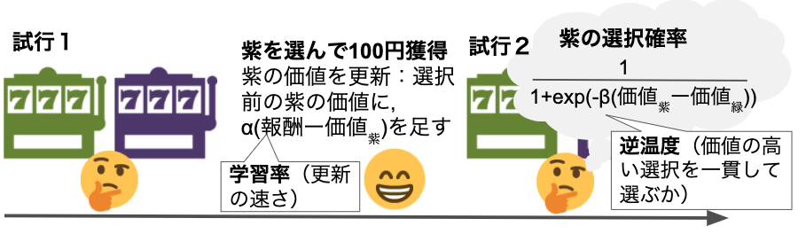
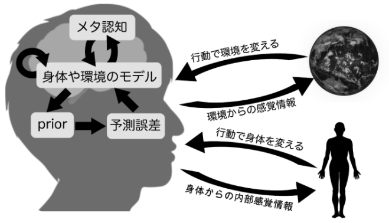

```{r xaringan-themer, include=FALSE, warning=FALSE}
library(xaringanthemer)
extra_css <- list(
  ".red"   = list(color = "red"),
  ".green"   = list(color = "green"),
  ".small" = list("font-size" = "60%"),
  ".med" = list("font-size" = "80%"),
  ".full-width" = list(
    display = "flex",
    width   = "100%",
    flex    = "1 1 auto"
  )
)

style_mono_accent(base_color = "#006400",
  text_font_size = "30px",
  code_font_size = "20px",
  padding = "1em 1em 1em 1em",#margin
  header_h1_font_size = "45px",
  header_h2_font_size = "40px",
  header_h3_font_size = "35px",
  header_color = "#006400",
  header_font_google = google_font("Song Myung"),
  text_font_google   = google_font("Song Myung", "400", "400i"),
  code_font_google   = google_font("Song Myung"),
  link_color = "#A52A2A",
  extra_css = extra_css
)
```

<!--30分-->

# 国里愛彦（くにさとよしひこ）
- 計算論的アプローチとRと自然をこよなく愛す
- 国里・片平・沖村・山下(2019).green[『計算論的精神医学: 情報処理過程から読み解く精神障害』]勁草書房


---
# 精神障害と生物学的基盤

- 精神障害の本質的な生物学的基盤は不明.med[(multifinal性：同一生物学的基盤から複数障害，equifinal性：複数の生物学的基盤から１つの障害)]


- 生物学的基盤（遺伝子，神経回路）と行動や症状との間には，.green[説明のギャップ]がある。
---
# 計算論的アプローチとは？

- 計算論的アプローチとは，.green[刺激と反応との間にある脳の情報処理過程を明示的に数理モデルにすることで，脳や心の動作原理を理解する]研究手法である(国里ら, 2019)。

→計算論的アプローチで説明のギャップを埋められるのでは？

- David Marr(1982)の３つの枠組み（.green[計算理論，表現とアルゴリズム，インプリメンテーション]）から検討する。

→　現象の記述だけでなく，プログラム可能なアルゴリズムまで踏み込んだ理解が可能かも？
---

# 計算論的アプローチ

- 神経・行動的現象の背景にあるプロセスを数理モデルによって検討するアプローチ(国里ら, 2019)。
- David Marr(1982)の３つの枠組み（計算理論，表現とアルゴリズム，インプリメンテーション）からなる。


---


# 計算論的アプローチの方法

- 入力から反応が生成される過程をモデル化した.green[生成モデル]を仮定することで，シミュレーションやデータから潜在過程が検討できる(国里ら,2018)。
---

# ４つの生成モデル

---

# 強化学習モデル

- 強化学習モデルは，生体が環境との相互作用して，.green[将来の報酬と罰を予測することに関する学習.med[(古典的条件づけ)]と将来の報酬を最大化もしくは罰を最小化する行動を選択することの学習.med[(道具的条件づけ)]をモデル化.small[（Kurth-Nelson et al.,2016)]]


---

# 計算論的アプローチの方法
- RのhBayesDMパッケージを使うと簡単にパラメータをベイズ推定してくれる。以下は,遅延割引課題のパラメータ推定のコード（１行だけ・・・）

```
output <- dd_hyperbolic(data = df, niter = 2000, nwarmup = 1000, nchain = 4, ncore = 4)
```

- 日本語解説.med[(https://kunisatolab.github.io/main/how-to-hBayesDM.html )]


---


# 計算論的アプローチの例：恐怖の再発

- 復元効果：消去後の消去とは別文脈で恐怖が再発すること


.med[復元効果のモデルは提案されているが，決定版がない。復元効果以外には，自然回復，復位効果，再獲得がある。詳しくは中島・遠座(2017)]
---

# 潜在原因モデル(Gershman & Niv, 2012)


- 観測されたデータ（CSやUSなど）は，潜在原因からP(観測データ|潜在原因)で生成されると考える（.green[生成過程]）。
- 生物は，ベイズ則に基づく.green[生成モデル]を用いて，観測されたデータから潜在原因を推測する。原因の推測＝学習
---

# 潜在原因モデルによる原因の推測

- 原因は離散なので推測に使う生成モデルは，ノンパラメトリックベイズになる。中華料理店過程を用いて，過去に観測されたデータから次の原因を予測する。

.med[→意味不明な名前だが，中華料理店のテーブルに順番に座っていく話で，各テーブルに座っている人の割合に応じて座るモデル（より多くの人が座っているテーブルに座る確率が高い）。なお，ある確率(α)で新しいテーブル（まだ誰も座っていない）に座る。]

→原因は無限にありえるが，中華料理店過程を使うと，原因の数が増えすぎず，生物の認知能力として妥当な数に収まる。

---

# 潜在原因モデルによるシミュレーション
- 潜在原因モデルを使えば，復元効果のシミュレーションが可能になる（ABAデザインだけでなく，ABCデザインでも）
.med[https://github.com/ykunisato/lcmr]

---

# 潜在原因モデルからの示唆


- Gershman & Hartley(2015)は，恐怖条件づけの獲得・消去をした次の日に再発テストをしたデータ(141名)に，潜在原因モデルを用いたモデルフィッティングを行った。

→推定された結果から，.green[用いる潜在原因の数が多いほど，再発しやすい]ことが示された。

- Gershman et al.(2013)は，潜在原因を増やさない方法として，段階的消去（一気に消去せず，USは少し残しずつ消去する）を提案した。

→動物実験で，.green[段階的消去の方が再発が少ない]ことを示した。

---
# どういう写真？

https://imgur.com/vsAtUs1
---

# 倒木でした〜

https://imgur.com/vsAtUs1
---
# 自由エネルギー原理
- ベイズの定理に基づいて，知覚・認知が，環境からのデータ（尤度）と信念（事前分布）をかけたものと考える。
- 予測と知覚のズレに対して，信念を更新する(予測符号化) or 予測に沿った近くを得るために行動する(能動的推論) 


---
# 認知行動療法の能動的推論モデル
- Smith et al.(preprint)は，能動的推論モデルを使って，蜘蛛恐怖の認知行動療法の作用機序をシミュレーションした


- 認知-感情-行動の交互作用をモデルに組み込んで，認知再構成と曝露をするダイナミクスを検討している
---
# 能動的推論モデルからの示唆

- 認知再構成（蜘蛛の危険性の事前確率を低下）をしてから曝露をした方が，消去学習が早い。
- 認知再構成後に曝露をする場合，「蜘蛛が自分を傷つけることはない(危険性0%)」みたいな信念より，「蜘蛛は自分を傷つけるかもしれないし，しないかもしれない(危険性50%)」のような信念の方が有効

→曝露の前に思考からの距離をとるマインドフスネスを行う場合のメカニズムを示唆している？

- Gershmanのような再発まで考慮したモデルではないので今後の拡張に期待。
---

# CPSYMAP.med[(Kato et al., preprint)]

- 計算論的精神医学研究をRDoCの分析単位とDSMなどの症状の行列上にマッピング(https://ncnp-cpsy-rmap.web.app/)


---

# 計算論的アプローチの前に

- 心理学研究100本のうち再現されたのは39本(Open Science Collaboration, 2016, Science)
- 引用数が多く効果があるとされた臨床医学研究45本のうち再現されたのは20本(Ioannidis, 2005, JAMA)
- 1576名の調査から，70%が他の研究者の研究を再現できず，50%が自分の研究の再現もできなかった(Baker, 2016, Nature)

→計算論的アプローチの前にやることがありそう・・・

---


# Take Home Message

- 計算論的アプローチは，精神障害のメカニズム研究に有用。
- 計算論的アプローチの認知行動療法への適用やその知見を蓄積する枠組みの整備も進みつつある。
- はじめの一歩としては，認知行動療法研究の特集号論文と.green[『計算論的精神医学』].med[(勁草書房, 2019年)]を読む，hBayesDMや国里のRパッケージなど使ってみる。

.med[謝辞：本発表にあたり，片平健太郎さん，沖村 宰さん，山下祐一さんとの議論が不可欠でした。心より感謝申し上げます。]
---


# 引用参文献
.small[
- Kato, A., Kunisato, Y., Katahira, K., Okimura, T., & Yamashita, Y. (2020). Computational Psychiatry Research Map (CPSYMAP): a New Database for Visualizing Research Papers (p. 2020.06.30.181198). https://doi.org/10.1101/2020.06.30.181198
- 国里愛彦・片平健太郎・沖村 宰・山下祐一(2019). 『計算論的精神医学: 情報処理過程から読み解く精神障害』 勁草書房
- 国里愛彦 (2018) 臨床心理学と認知モデリング　心理学評論, 61(1), 55-66.
- Hoff, P., Maatz, A., & Vetter, J. S. (2020). Diagnosis as dialogue: historical and current perspectives. Dialogues in Clinical Neuroscience, 22(1), 27–35.
- Gershman, S. J., & Hartley, C. A. (2015). Individual differences in learning predict the return of fear. Learning & Behavior, 43(3), 243–250.
- Gershman, S. J., Jones, C. E., Norman, K. A., Monfils, M.-H., & Niv, Y. (2013). Gradual extinction prevents the return of fear: implications for the discovery of state. Frontiers in Behavioral Neuroscience, 7, 164.
- Gershman, S. J., & Niv, Y. (2012). Exploring a latent cause theory of classical conditioning. Learning & Behavior, 40(3), 255–268.
]
---

# 引用文献
.small[
- 中島定彦・遠座奈々子(2017). 不安症状の再発―パヴロフ型条件づけの基礎研究と理論から―. 基礎心理学研究, 35(2), 163–177.
- Sanislow, C. A., Ferrante, M., Pacheco, J., Rudorfer, M. V., & Morris, S. E. (2019). Advancing Translational Research Using NIMH Research Domain Criteria and Computational Methods. Neuron, 101(5), 779–782.
- Smith, R., Moutoussis, M., & Bilek, E. (2020). Simulating the computational mechanisms of cognitive and behavioral psychotherapeutic interventions: Insights from active inference. https://doi.org/10.31234/osf.io/8m62p
]