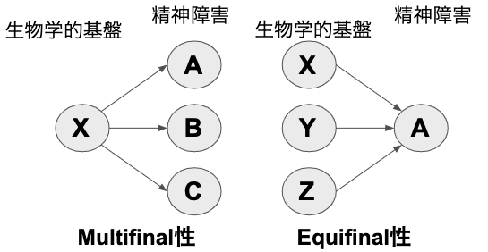
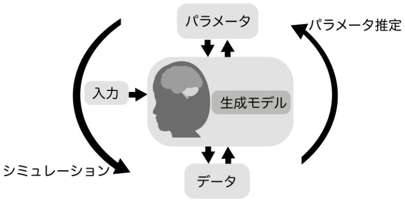
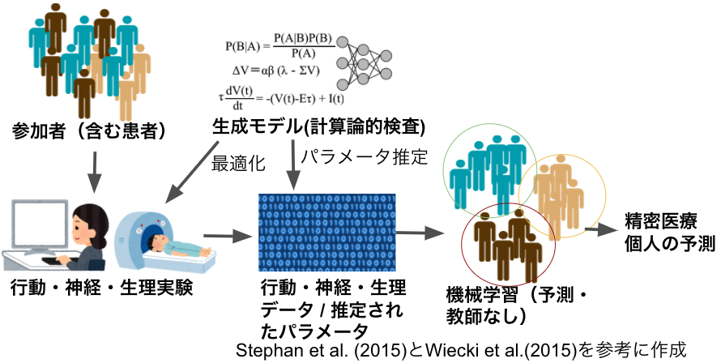
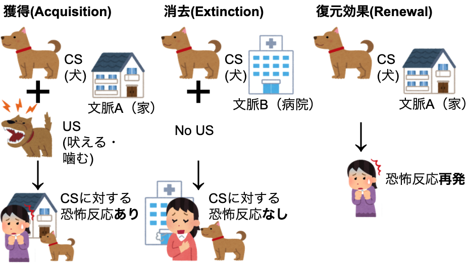
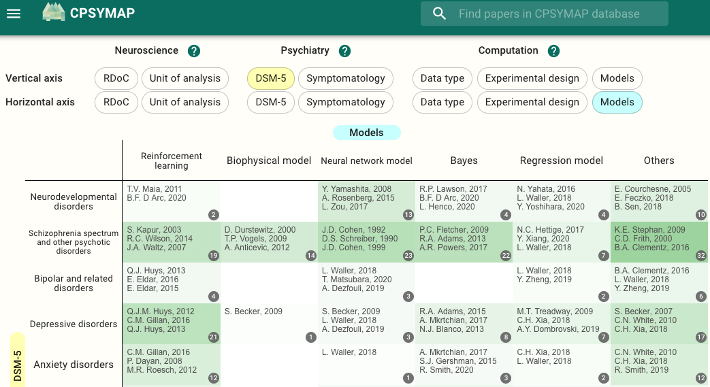

```{r xaringan-themer, include=FALSE, warning=FALSE}
library(xaringanthemer)
extra_css <- list(
  ".red"   = list(color = "red"),
  ".green"   = list(color = "green"),
  ".small" = list("font-size" = "60%"),
  ".med" = list("font-size" = "80%"),
  ".full-width" = list(
    display = "flex",
    width   = "100%",
    flex    = "1 1 auto"
  )
)

style_mono_accent(base_color = "#006400",
  text_font_size = "30px",
  code_font_size = "20px",
  padding = "1em 1em 1em 1em",#margin
  header_h1_font_size = "45px",
  header_h2_font_size = "40px",
  header_h3_font_size = "35px",
  header_color = "#006400",
  header_font_google = google_font("Song Myung"),
  text_font_google   = google_font("Song Myung", "400", "400i"),
  code_font_google   = google_font("Song Myung"),
  link_color = "#A52A2A",
  extra_css = extra_css
)
```

<!--30分-->

# 国里愛彦（くにさとよしひこ）
- 計算論的アプローチとRと自然をこよなく愛す
- .green[『計算論的精神医学: 情報処理過程から読み解く精神障害』](国里・片平・沖村・山下, 2019年, 勁草書房)


---
# 精神障害と生物学的基盤

- 精神障害の本質的な生物学的基盤は不明.med[(multifinal性：同一生物学的基盤から複数障害，equifinal性：複数の生物学的基盤から１つの障害)]


- 生物学的基盤（遺伝子，神経回路）と行動や症状との間には，.green[説明のギャップ]がある(心理学に共通する問題？)
---
# 計算論的アプローチとは？

- 計算論的アプローチとは，.green[刺激と反応との間にある脳の情報処理過程を明示的に数理モデルにすることで，脳や心の動作原理を理解する]研究手法である(国里ら, 2019)。

→計算論的アプローチで説明のギャップを埋められるのでは？

- David Marr(1982)の３つの枠組み（.green[計算理論，表現とアルゴリズム，インプリメンテーション]）から検討する。

→現象の記述だけでなく，プログラム可能なアルゴリズムまで踏み込んだ理解が可能かも？
---

# Marrの3つの水準


- 計算理論は問題を設定・制約し，検証可能なアルゴリズムを導く

---

# 計算論的アプローチの方法

- 入力から反応が生成される過程をモデル化した.green[データ生成モデル]を仮定することで，シミュレーションやデータから潜在過程が検討できる(国里ら,2018)。

---
# ４つの生成モデル

---

# ４つの生成モデルとツールボックス


---
# 計算論的アプローチの利点

- 疾病分類とバイオマーカーの洗練化：行動・脳画像データに生成モデルを適用した検査を行う.green[計算論的検査].med[(Computational assay, Stephan & Mathys, 2014)]の開発

- 説明のギャップを埋める:シナプスなどの生物学的な話がどのように行動につながるのか説明する

- 効果的な治療法・検査法の探索:十分に人の行動・神経活動をシミュレートできる生成モデルがあれば，実験前に探索可能（行動データ測定の最適化にもつながる:.green[適応型デザイン]）
---

# 理論駆動とデータ駆動

- 生成モデルによる.green[理論駆動アプローチ]だけでなく，.green[データ駆動型アプローチ]もある。
- Bishop (2006, PRML)は，機械学習におけるモデルを，.green[生成モデル，識別モデル，識別関数]にわけて説明している.med[（生成モデルは，データとパラメータの同時分布からデータ生成過程を記述するので，入力から人口データが生成できる）]。
- 理論が仮定できない状況においては，データ駆動アプローチも有用。
- 計算論的精神医学は，狭くは理論駆動アプローチだが，データ駆動アプローチも含む

---
# 生成モデルと識別モデルの組み合わせ


---

# 計算論的アプローチの例：恐怖の再発

- 復元効果：消去後の消去とは別文脈で恐怖が再発すること


.med[復元効果のモデルは提案されているが，決定版がない。復元効果以外には，自然回復，復位効果，再獲得がある。詳しくは中島・遠座(2017)]
---

# 潜在原因モデル(Gershman & Niv, 2012)


- 観測されたデータ（CSやUSなど）は，潜在原因からP(観測データ|潜在原因)で生成されると考える（.green[生成過程]）。
- 生物は，ベイズ則に基づく.green[生成モデル]を用いて，観測されたデータから潜在原因を推測する。原因の推測＝学習
---

# 潜在原因モデルによる原因の推測

- 原因は離散なので推測に使う生成モデルは，ノンパラメトリックベイズになる。中華料理店過程を用いて，過去に観測されたデータから次の原因を予測する。

.med[→意味不明な名前だが，中華料理店のテーブルに順番に座っていく話で，各テーブルに座っている人の割合に応じて座るモデル（より多くの人が座っているテーブルに座る確率が高い）。なお，ある確率(α)で新しいテーブル（まだ誰も座っていない）に座る。]

→原因は無限にありえるが，中華料理店過程を使うと，原因の数が増えすぎず，生物の認知能力として妥当な数に収まる。

---

# 潜在原因モデルによるシミュレーション
- 潜在原因モデルを使えば，復元効果のシミュレーションが可能になる（ABAデザインだけでなく，ABCデザインでも）
.med[https://github.com/ykunisato/lcmr]

---

# 潜在原因の数と恐怖の再発の個人差

- Gershman & Hartley(2015)は，恐怖条件づけの獲得・消去をした次の日に再発テストをしたデータ(141名)に，潜在原因モデルを用いたモデルフィッティングを行った。

→推定された結果から，.green[用いる潜在原因の数が多いほど，再発しやすい]ことが示された。

- Gershman et al.(2013)は，潜在原因を増やさない方法として，段階的消去（一気に消去せず，USは少し残しずつ消去する）を提案した。

→動物実験で，.green[段階的消去の方が再発が少ない]ことを示した。

---
# 潜在原因モデルを使うには

- GershmanがMatlabコードをGithubに公開
- 国里がMatlabからRに移植したRパッケージをGithubで公開(https://github.com/ykunisato/lcmr )
- lcmrでは，C++による高速化，粒子群最適化による推定，Latent Cause Modulated Rescorla-Wagner model: LCM-RWの実装(パラメータリカバリーがまだ上手くいかない)を追加しました（C++と粒子群最適化はまだ公開できてない）。
- Rユーザーだとlcmrが便利
---
# 実データに潜在原因モデルを使ってみる

- 68名の大学生に恐怖条件づけ実験を実施(CS:図形刺激，US:恐怖顔と叫び声）。アウトカムはUS予期.small[（再発効果は再現せず...）]
-  $\alpha$ の高い人の方が，US予期の変動性が大きい。


---
# 潜在原因の数（α）と恐怖の獲得・消去
-  $\alpha$ が高い方が（原因が多い方が），CS-への反応が低くなりにくい（弁別が弱いor般化しやすい？）。


---
# 潜在原因モデルのまとめ

- 恐怖条件づけの再発過程のモデルとして潜在原因モデルは魅力的な説明を提供する

- 実データに潜在原因モデルを適用した研究が少ないので，パラメータ推定方法についての工夫がまだ分からない。

- パラメータの解釈は，モデルからできるわけだが，粒子フィルターの挙動を掴むのに苦労する・・・

→まだ国里の鍛錬が必要です・・・
---
# ベイズ推論モデル(自由エネルギー原理)
- ベイズの定理に基づいて，知覚が環境からのデータ（尤度）と信念（事前分布）をかけたものと考える。
- 予測と知覚のズレに対して，信念を更新する(予測符号化) or 予測に沿った近くを得るために行動する(能動的推論) 


---
# 認知行動療法の能動的推論モデル
- Smith et al.(pre print)は，能動的推論モデルを使って，蜘蛛恐怖の認知行動療法の作用機序をシミュレーションした


- 認知-感情-行動の交互作用をモデルに組み込んで，認知再構成と曝露をするダイナミクスを検討している
---
# 能動的推論モデルからの示唆

- 認知再構成（蜘蛛の危険性の事前確率を低下）をしてから曝露をした方が，消去学習が早い。
- 認知再構成後に曝露をする場合，「蜘蛛が自分を傷つけることはない(危険性0%)」みたいな信念より，「蜘蛛は自分を傷つけるかもしれないし，しないかもしれない(危険性50%)」のような信念の方が有効

→曝露の前に思考からの距離をとるマインドフスネスを行う場合のメカニズムを示唆している？

- モデルフィッティングは今後の課題だが，いくつかの変数が時間的に発展する過程をおえるのが魅力。
---
# 再現性の危機と行動課題

- 心理学研究100本のうち再現されたのは39本(Open Science Collaboration, 2016, Science)
- 1576名の調査から，70%が他の研究者の研究を再現できず，50%が自分の研究の再現もできなかった(Baker, 2016, Nature)
- ヒトを対象とした恐怖条件づけもどうも再現性が低そう...

→再現しない，確実ではない行動データ（さらには行動課題中の神経データ）に対して，複雑なモデルを適用する意味は？

→計算論的アプローチの前にやるべきことがあるのでは？

---

# CPSYMAP.med[(Kato et al., preprint)]

- 計算論的精神医学研究をRDoCの分析単位とDSMなどの症状の行列上にマッピング(https://ncnp-cpsy-rmap.web.app/)


---

# 単発の研究ではなくメタ分析的思考へ

- CPSYMAPでは，計算論的精神医学研究の各領域・モデルにおける蓄積具合を可視化している。
- これに研究知見を追加するモジュールなどを追加していくことで，１つのハイインパクト雑誌に掲載された論文にひっぱられた議論ではなく，メタ分析的な思考による判断が可能になるのでは？

---

# 再現性の高いデータ収集に向けて

- 論文の紙面上で記載されている情報が少なすぎて，再現ができない可能性がある。
- 論文になってない研究室の秘伝の情報などがあるかもしれない。

→これって本当に科学？

- データ収集にかかわるマテリアルのオープン化，コラボレーション，分業化が必要？


---
# Take Home Message

- 計算論的精神医学は，精神障害のメカニズム研究に有用

- 計算論的精神医学研究を推進するために使えるツールも増えてきている

- 恐怖条件づけの再発に関するモデルとして潜在原因モデルがある（能動的推論モデルの今度の展開に期待）

- 計算論的アプローチを進めつつ再現性を高める取り組みを（メタ分析，行動データ収集のオープン化）

.med[謝辞：本発表にあたり，片平健太郎さん，沖村 宰さん，山下祐一さんとの議論が不可欠でした。心より感謝申し上げます。]
---


# 引用参文献
.small[
- Kato, A., Kunisato, Y., Katahira, K., Okimura, T., & Yamashita, Y. (2020). Computational Psychiatry Research Map (CPSYMAP): a New Database for Visualizing Research Papers (p. 2020.06.30.181198). https://doi.org/10.1101/2020.06.30.181198
- 国里愛彦・片平健太郎・沖村 宰・山下祐一(2019). 『計算論的精神医学: 情報処理過程から読み解く精神障害』 勁草書房
- 国里愛彦 (2018) 臨床心理学と認知モデリング　心理学評論, 61(1), 55-66.
- Hoff, P., Maatz, A., & Vetter, J. S. (2020). Diagnosis as dialogue: historical and current perspectives. Dialogues in Clinical Neuroscience, 22(1), 27–35.
- Gershman, S. J., & Hartley, C. A. (2015). Individual differences in learning predict the return of fear. Learning & Behavior, 43(3), 243–250.
- Gershman, S. J., Jones, C. E., Norman, K. A., Monfils, M.-H., & Niv, Y. (2013). Gradual extinction prevents the return of fear: implications for the discovery of state. Frontiers in Behavioral Neuroscience, 7, 164.
- Gershman, S. J., & Niv, Y. (2012). Exploring a latent cause theory of classical conditioning. Learning & Behavior, 40(3), 255–268.
]
---

# 引用文献
.small[
- 中島定彦・遠座奈々子(2017). 不安症状の再発―パヴロフ型条件づけの基礎研究と理論から―. 基礎心理学研究, 35(2), 163–177.
- Sanislow, C. A., Ferrante, M., Pacheco, J., Rudorfer, M. V., & Morris, S. E. (2019). Advancing Translational Research Using NIMH Research Domain Criteria and Computational Methods. Neuron, 101(5), 779–782.
- Smith, R., Moutoussis, M., & Bilek, E. (2020). Simulating the computational mechanisms of cognitive and behavioral psychotherapeutic interventions: Insights from active inference. https://doi.org/10.31234/osf.io/8m62p
- Stephan, K. E., Iglesias, S., Heinzle, J., & Diaconescu, A. O. (2015). Translational Perspectives for Computational Neuroimaging. Neuron, 87(4), 716–732.
- Wiecki, T. V., Poland, J., & Frank, M. J. (2015). Model-Based Cognitive Neuroscience Approaches to Computational Psychiatry: Clustering and Classification. Clinical Psychological Science, 3(3), 378–399.
]